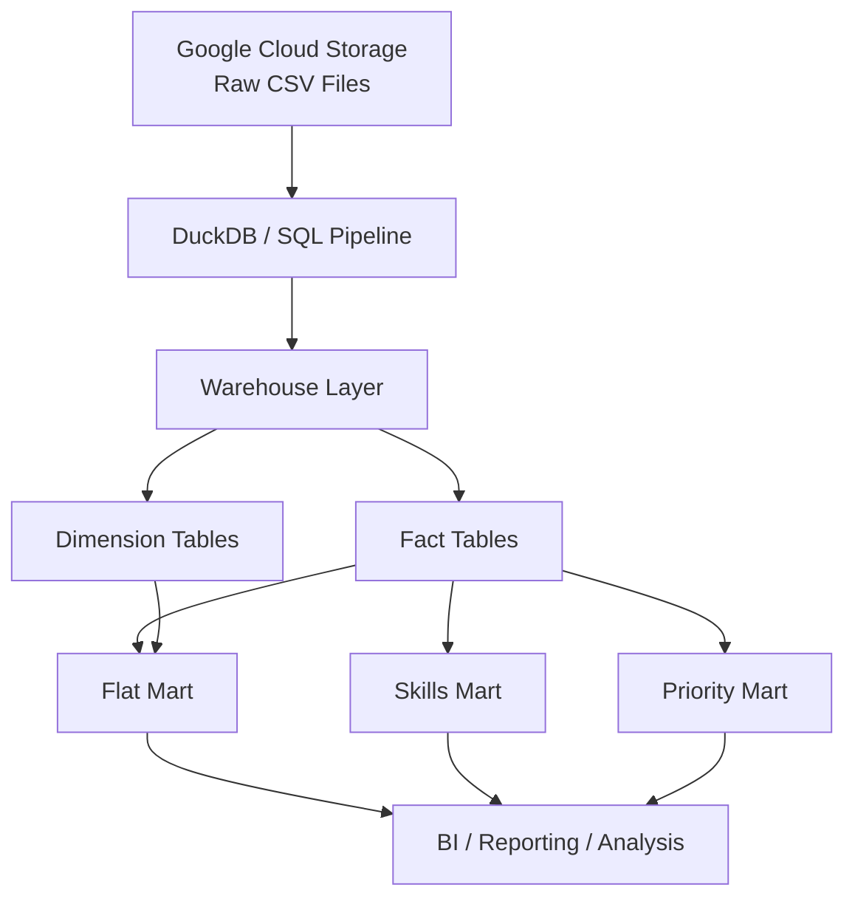
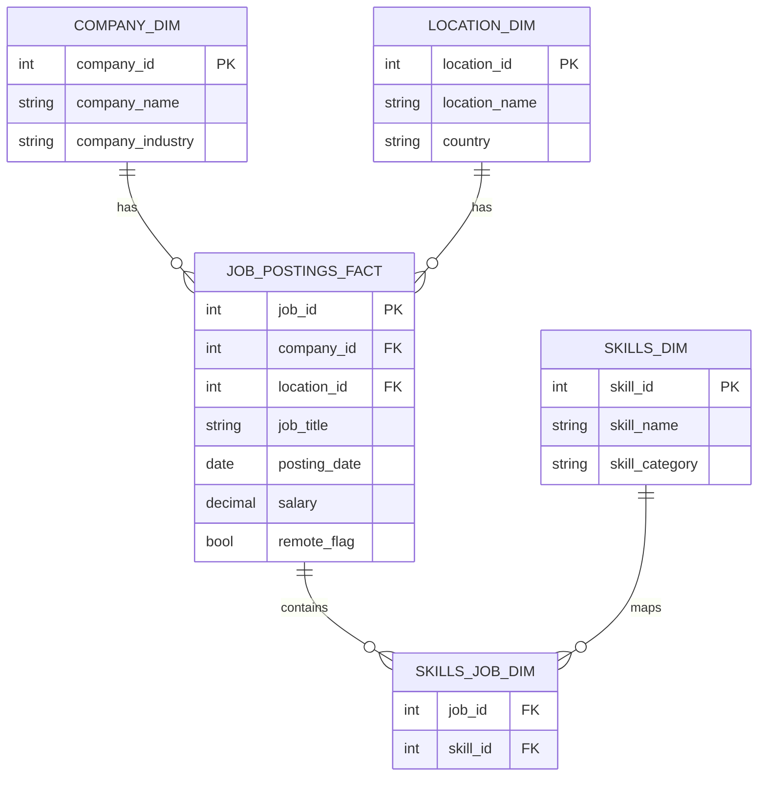
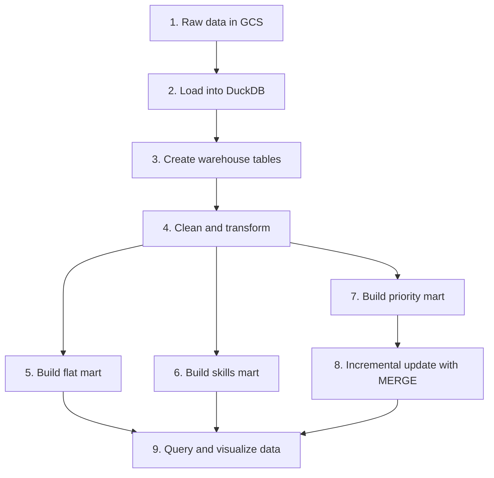

# 🏗️ WH Mart Build | Data Warehouse & Analytical Marts

> Building a modern data warehouse and analytical marts for job market insights using SQL, DuckDB, and ELT workflows.

---

## Project Summary

WH Mart Build is a data engineering project that transforms raw job-posting data into a structured, analytical warehouse. The solution ingests CSV files from Google Cloud Storage, models the data into a fact-and-dimension warehouse, and builds reporting marts for business analysis.

This project demonstrates how raw operational data can be organized into a production-style analytical layer that supports trend analysis, hiring insights, and strategic decision-making.

---

## Why This Project Matters

Job data is often messy, scattered, and difficult to analyze without a proper warehouse model. Businesses need clean, reliable data to answer questions like:

- Which skills are increasing in demand?
- Which companies are hiring the most?
- How do salaries vary by role, location, or company?
- Which job categories are strategic priorities?

This project solves that problem by creating a warehouse and mart layer that makes the data usable for analytics and reporting. It supports better hiring decisions, labor market analysis, and scalable data consumption across teams.

---

## Business Value

This project adds value by:

- turning raw files into a trusted analytical source
- enabling faster reporting and BI consumption
- organizing data into a star schema
- supporting trend analysis over time
- reducing repeated manual data preparation
- creating reusable SQL-based data engineering workflows

---

## Architecture



---

## Warehouse Design

The warehouse follows a star schema to support analytical querying and reporting efficiency.



This model separates business facts from descriptive attributes, making analysis and aggregation more efficient.

---

## Project Workflow



### Step-by-step flow

#### 1. Create the warehouse schema
Define the raw-to-warehouse structure using SQL DDL.

#### 2. Load source data
Import flat CSV files from Google Cloud Storage into DuckDB.

#### 3. Transform and normalize
Clean, standardize, and map data into warehouse-friendly structures.

#### 4. Build the flat mart
Create a denormalized reporting layer for quick exploration.

#### 5. Build the skills mart
Track skill demand and role trends over time.

#### 6. Build the priority mart
Monitor key hiring categories and business-critical roles.

#### 7. Apply incremental updates
Use `MERGE` logic to keep the warehouse current without full rebuilds.

#### 8. Query and analyze
Use marts for reporting, analysis, and decision support.

---

## Data Marts

### Flat Mart
A denormalized table designed for quick reporting and exploratory analysis.

### Skills Mart
Supports labor market reporting by tracking skills trends and demand over time.

### Priority Mart
Focuses on strategic roles and high-priority hiring categories.

---

## Tech Stack and Skills Demonstrated

### Tools and Technologies
- DuckDB
- SQL
- Google Cloud Storage
- Git / GitHub
- VS Code
- Data modeling concepts

### Skills Demonstrated
- Data warehousing
- Dimensional modeling
- Star schema design
- ELT pipeline development
- Data transformation and cleaning
- Incremental data loading
- Data mart creation
- Reporting data preparation
- SQL optimization and redesign
- Production-style data engineering practices

---

## Repository Structure

```text
2_WH_Mart_Build/
├── 01_create_tables_dw.sql        # Create warehouse tables
├── 02_load_schema_dw.sql          # Load raw data into warehouse
├── 03_create_flat_mart.sql        # Build flat mart
├── 04_create_skills_mart.sql      # Build skill demand mart
├── 05_create_priority_mart.sql    # Build priority mart
├── 06_update_priority_mart.sql    # Incremental update flow
├── 07_create_company_mart.sql     # Optional company mart
├── build_dw_marts.sql             # Master orchestration script
├── README.md                      # Project documentation
├── Resources/                     # Supporting files
└── SQL/                           # Additional SQL assets if present
```

---

## Example Analytical Questions

This warehouse supports queries such as:

- Which skills are most in demand for data engineering roles?
- What is the monthly demand trend for cloud and SQL skills?
- Which companies hire the most remote professionals?
- How do salaries vary by title and location?
- Which job categories should be treated as strategic priorities?

---

## Recruiter-Friendly Summary

This project showcases my ability to design and implement a real-world data warehouse using SQL and modern data engineering practices. I built a robust ELT workflow that ingests raw job-posting data into a warehouse, transforms it into a model suitable for analytics, and creates business-ready marts for reporting.

It highlights key data engineering skills such as:
- dimensional modeling
- SQL transformation logic
- data pipeline design
- warehouse architecture
- incremental updates
- reporting layer creation
- practical cloud-based data workflows

This is a strong portfolio project for roles in data engineering, analytics engineering, BI engineering, and data warehousing.

---

## Key SQL Concepts Demonstrated

- `CREATE TABLE`
- `INSERT INTO ... SELECT`
- `MERGE` for incremental updates
- CTEs for transformation logic
- `CASE WHEN` for classification
- date grouping and aggregation
- reusable SQL orchestration

---

## How to Run

Use DuckDB and run the scripts in sequence:

```sql
.read 01_create_tables_dw.sql
.read 02_load_schema_dw.sql
.read 03_create_flat_mart.sql
.read 04_create_skills_mart.sql
.read 05_create_priority_mart.sql
.read 06_update_priority_mart.sql
.read 07_create_company_mart.sql
```

Or run the full build script:

```sql
.read build_dw_marts.sql
```

---

## Summary

WH Mart Build is a practical data engineering project that combines warehouse architecture, ELT processes, and analytical mart design. It reflects strong fundamentals in data modeling, SQL-based transformation, and production-ready data workflows—qualities highly valued in data engineering and analytics roles.